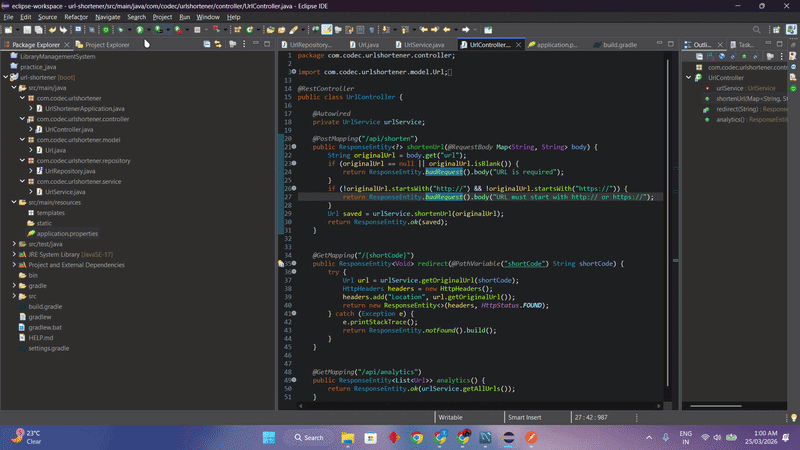
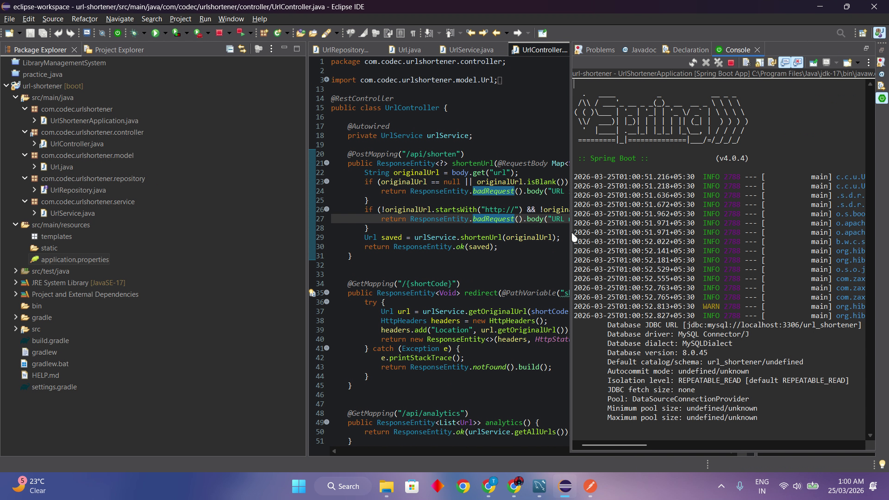
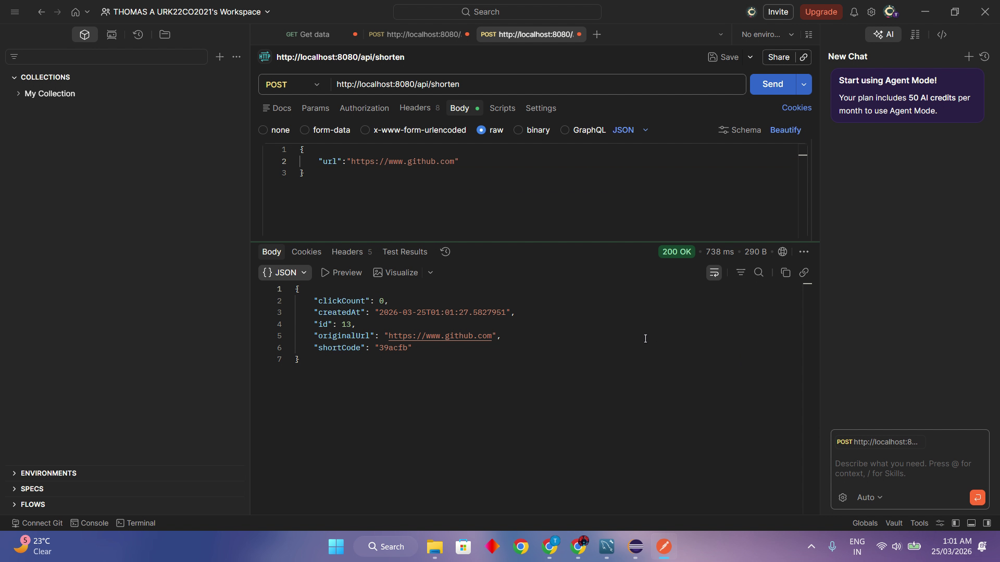
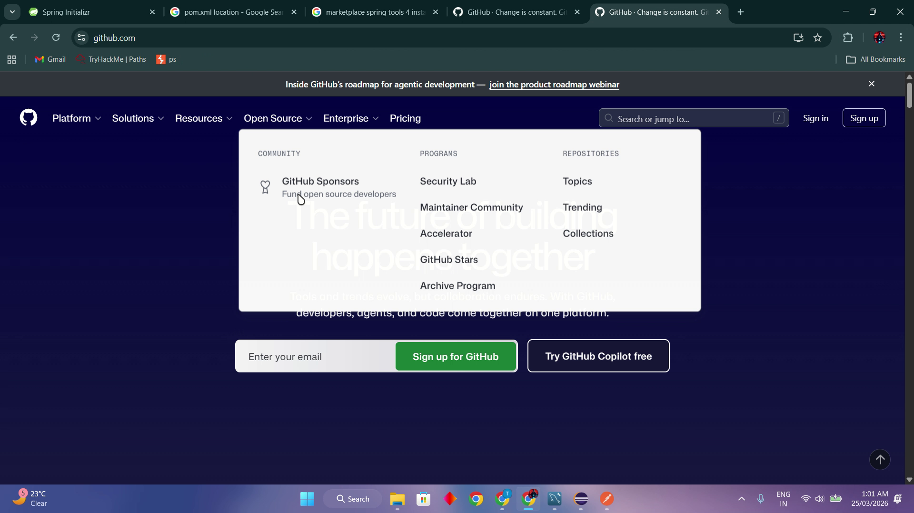
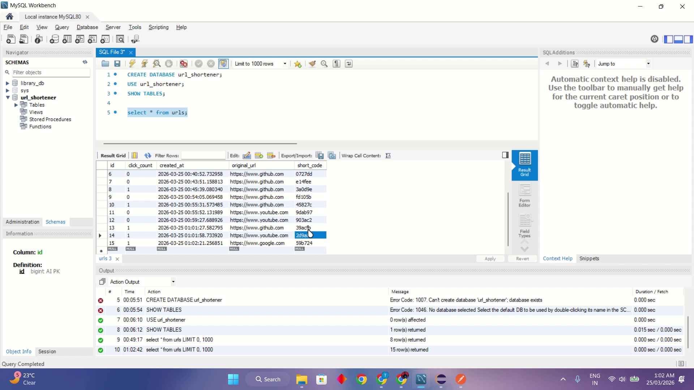

# 🔗 URL Shortener

> Shorten long URLs like a pro 🚀 — because nobody likes sharing huge ugly links 😎

A modern and beginner-friendly **URL Shortener REST API** built using **Java, Spring Boot, Spring Data JPA, and MySQL**.
This project was developed as part of my **internship at Codec Technologies** to strengthen my practical skills in **backend development, REST API creation, database connectivity, and layered architecture design**. 💻✨

---

## ✨ Features

* 🔗 **URL Shortening**

  * Convert long URLs into short and clean links
  * Generate unique **6-character short codes**
  * Easy to share shortened URLs

* 🌐 **Instant Redirection**

  * Redirect shortened URLs to the original long URL
  * Uses **HTTP 302 redirect**

* 📈 **Click Tracking**

  * Track how many times each shortened URL was visited
  * Automatically updates click count on every redirect

* 📊 **Analytics API**

  * View all shortened URLs
  * See original URL, short code, and total clicks

* 🏗️ **Layered Architecture**

  * Clean project structure using:

    * Controller
    * Service
    * Repository
    * Model

* 🗄️ **Database Integration**

  * Store URLs permanently in **MySQL**
  * Uses **Spring Data JPA / Hibernate** for database operations

---

## 🛠️ Tech Stack

* **Java 17** ☕
* **Spring Boot** 🌱
* **Spring Data JPA / Hibernate** 🗃️
* **MySQL** 🛢️
* **Gradle** ⚙️
* **Postman** 🧪
* **Eclipse** 💻

---

## 🎯 Internship Project

This project was created during my **internship at Codec Technologies** as a practical backend-based URL shortening solution.
It helped me gain hands-on experience in:

* REST API development
* Spring Boot backend architecture
* MySQL database integration
* Spring Data JPA / Hibernate
* CRUD operations
* Redirect handling with HTTP responses
* Real-world backend project structure

---

## 📂 Project Structure

```
src/
 └── main/
     ├── java/
     │    └── com/example/urlshortener/
     │         ├── UrlShortenerApplication.java
     │         ├── controller/
     │         │     └── UrlController.java
     │         ├── service/
     │         │     └── UrlService.java
     │         ├── repository/
     │         │     └── UrlRepository.java
     │         └── model/
     │               └── Url.java
     └── resources/
           └── application.properties
```

---

## 🧠 How It Works

1. User sends a long URL to the **shorten API** 🔗
2. System generates a unique **6-character short code** ✨
3. URL and short code are stored in **MySQL** 🗄️
4. User accesses the short link 🌐
5. System redirects to the original URL using **HTTP 302** ↩️
6. Click count increases automatically 📈
7. Analytics API shows all shortened URLs with usage details 📊

---

## 📡 API Endpoints

### 1️⃣ Shorten URL

* **POST** `/api/shorten`

**Example Request Body**

```json
{
  "url": "https://www.github.com"
}
```

**Purpose:**
Creates a short URL from a long URL.

---

### 2️⃣ Redirect to Original URL

* **GET** `/{shortCode}`

**Purpose:**
Redirects the user to the original URL using the short code.

---

### 3️⃣ View Analytics

* **GET** `/api/analytics`

**Purpose:**
Returns all shortened URLs with their click counts and details.

---

## 🗃️ Database

This project uses **MySQL** to store shortened URLs.

### Main Table: `url`

The table stores:

* Original long URL
* Generated short code
* Click count

---

## ▶️ How to Run

1. Clone this repository
2. Open the project in IntelliJ IDEA / Eclipse
3. Create a MySQL database (example: `urlshortener`)
4. Update DB credentials in `src/main/resources/application.properties`
5. Build and run the project using Gradle
6. Test the APIs using Postman or curl

---

## ⚙️ Configuration

Update your `application.properties` file:

```properties
spring.datasource.url=jdbc:mysql://localhost:3306/urlshortener
spring.datasource.username=your_username
spring.datasource.password=your_password
spring.jpa.hibernate.ddl-auto=update
```

---

## 🧪 Sample Test

### Shorten a URL using cURL

```bash
curl -X POST http://localhost:8080/api/shorten \
  -H "Content-Type: application/json" \
  -d '{"url": "https://www.github.com"}'
```

---


## 🎞️ Demo Preview


▶️ Watch Full Demo on YouTube

## 🎥 YouTube Demo

[](https://youtu.be/P53ogT6bSbo)


## 📸 Project Outputs

### 1️⃣ Output 1


### 2️⃣ Output 2


### 3️⃣ Output 3


### 4️⃣ Output 4


---

## 🌟 Why This Project is Special

This is not just a basic API project 😎
It includes:

* Real-world URL shortening workflow
* Clean REST API design
* Database persistence
* Short code generation
* Redirect handling
* Click tracking analytics
* Layered backend architecture

**Perfect for:**

* 🎓 College mini project
* 🎓 Final year project
* 💼 Resume / portfolio
* 👨‍💻 Spring Boot practice
* 🎤 Interview explanation

---

## 🚀 Future Improvements

* 🔐 User authentication / admin login
* ⏳ Link expiration support
* 📝 Custom short codes
* 📊 Advanced analytics dashboard
* 📅 Timestamp for created links
* 🚫 Duplicate URL handling optimization
* 🌍 Deploy to cloud (Render / Railway / AWS)

---
---

## 📧 Contact

📧 **Email:** [support@codectechnologies.in](mailto:support@codectechnologies.in)
🌐 **Website:** [www.codectechnologies.in](http://www.codectechnologies.in)

## 🙌 Author

**Thomas A**
Built with patience, debugging, coffee, and determination ☕🔥

---

## ⭐ Support

If you like this project, give it a star ⭐
It will make this little URL shortener very happy 🔗😄


---

## 📜 License

This project is for learning, educational, and portfolio purposes.
